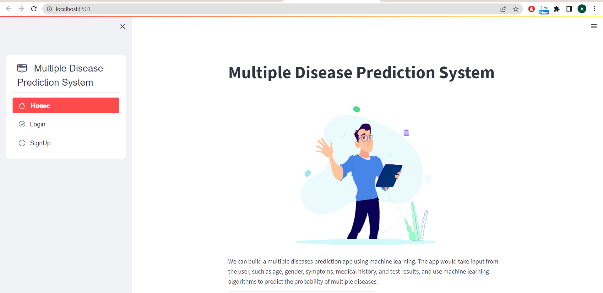
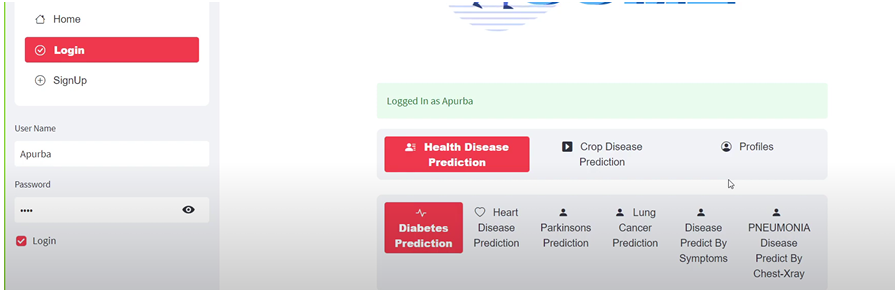
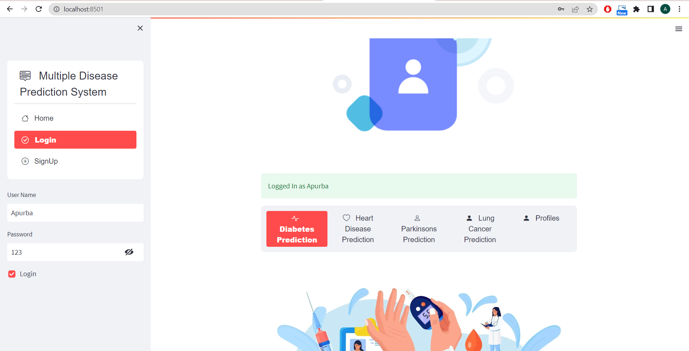
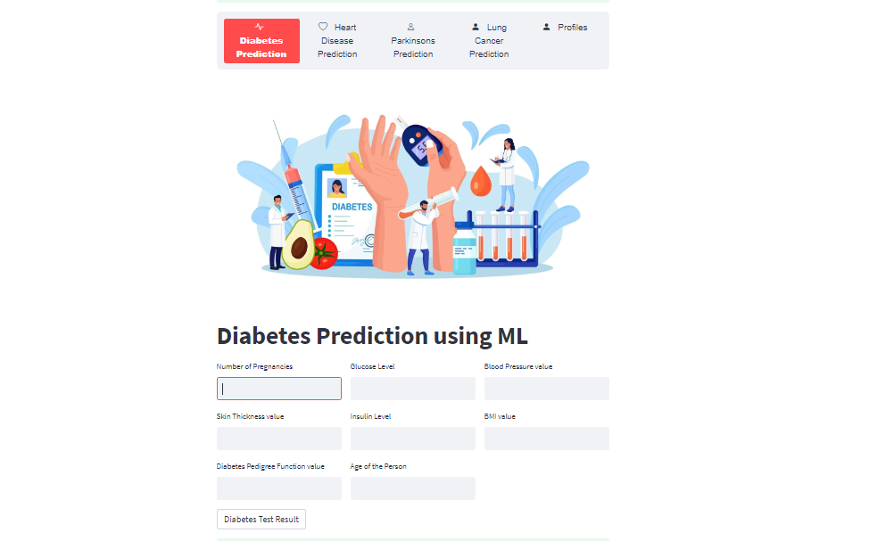
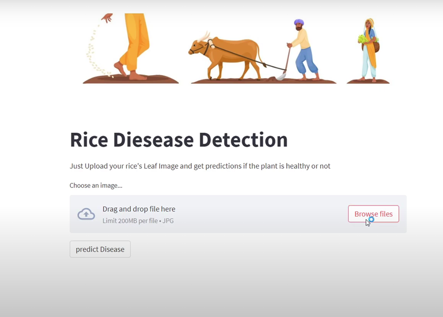

# Multiple Disease and Crop Disease Prediction Web App

This project is a **multiple disease prediction** and **crop disease detection** web application built with Streamlit. It uses machine learning models to predict the likelihood of human diseases and detect crop diseases based on user input and uploaded images.

## Overview

This application provides an intuitive interface for users to input their health-related information or upload crop images. It uses pre-trained machine learning models to predict diseases, offering insights for early detection and treatment.

**Important Note:** The predictions are for informational purposes only and are not medical or agricultural advice. Please consult a professional for accurate diagnosis and recommendations.

---

## Features

### Human Disease Prediction
- Predicts the likelihood of:
  - **Diabetes**
  - **Heart Disease**
  - **Parkinson's Disease**
  - **Lung Cancer**
  - **Diseases Based on Symptoms**
  - **Pneumonia Detection Using Chest X-ray**

### Crop Disease Prediction
- Detects diseases for crops like:
  - **Tomato**
  - **Rice**
  - **Wheat**
  - **Apple**

### Additional Features
- **User Authentication:** Login and signup functionality with profile management.
- **Interactive UI:** Powered by Streamlit for simplicity and user-friendliness.
- **Lottie Animations:** Enhanced user experience with animations.

---

## Datasets Used
The application employs models trained on datasets sourced from Kaggle:
- **Diabetes:** [Diabetes Dataset](https://www.kaggle.com/datasets/kandij/diabetesdataset)
- **Heart Disease:** [Heart Disease Dataset](https://www.kaggle.com/datasets/johnsmith88/heart-disease-dataset)
- **Parkinson's Disease:** [Parkinson's Dataset](https://www.kaggle.com/datasets/gargmanas/parkinsonsdataset)
- **Lung Cancer:** [Lung Cancer Dataset](https://www.kaggle.com/datasets/mysarahmadbhat/lung-cancer)

For crop diseases, custom datasets were used during model training.

---

## Technologies Used
- **Programming Language:** Python
- **Libraries/Frameworks:**
  - Streamlit
  - Pandas
  - NumPy
  - TensorFlow/Keras
  - Pickle
  - SQLite
  - OpenCV
  - PIL (Pillow)
  - Requests
  - Streamlit Lottie
- **Environment Management:** Anaconda (recommended)

---

## How to Run

1. **Clone the Repository:**
   ```bash
   git clone https://github.com/Apurba0012/multiple_disease_prediction_webapp.git
   
2.  **Navigate to the Project Directory:**
    ```bash
    cd multiple_disease_prediction_webapp/webapp # Navigate to the webapp directory
    ```
3.  **Create a Conda Environment (Recommended):**
    ```bash
    conda create -n disease_prediction python=3.9  # Or your preferred Python version
    conda activate disease_prediction
    ```
5.  **Run the Streamlit App:**
    ```bash
    streamlit run multiple_disease_prediction.py # Replace your_main_script_name.py with the name of your main python file. Usually app.py or main.py.
    ```

## Screenshots

Here are some screenshots of the application:
### Main Screen



### Add Item Screen




